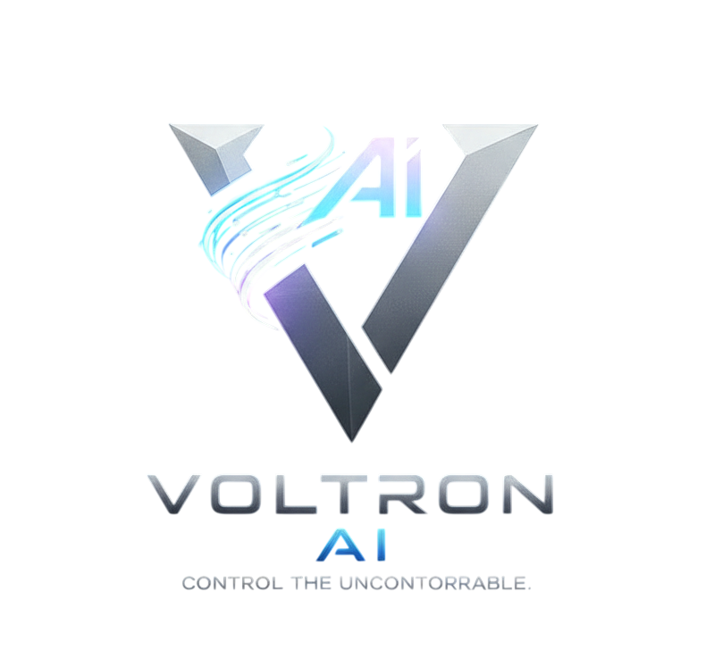

<p align="center">
  
</p>

<h1 align="center">VOLTRON</h1>

<p align="center">
  
  
  = 20" />
</p>

<p align="center">
  <strong>Your AI coding agent just mass-deleted your src/ folder.<br />What would you have done?</strong>
</p>

<p align="center">
  Voltron watches every file operation, classifies risk in real-time,<br />
  and stops dangerous actions before they happen.
</p>

---

## The Horror Stories

Without Voltron, these happen silently:

| Scenario | What happens | Risk Level |
|----------|-------------|------------|
| Agent touches `.env` | Your production secrets are exposed or deleted | 🔴 CRITICAL |
| Agent modifies 200 files in 5 seconds | Cascade of changes you can't review or undo | 🔴 CRITICAL |
| Agent rewrites database migrations | Your schema is corrupted, data is lost | 🟠 HIGH |
| Agent deletes entire directories | Hours of work gone in milliseconds | 🔴 CRITICAL |

**Voltron would have caught every single one of these.** In real-time. Before damage was done.

---

## See It In Action

<!-- Replace with actual demo GIF -->


*30-second demo: Agent spawns → files created → .env touched → CRITICAL alert → automatic emergency stop*

---

## Quick Start

```bash
# Method 1: npx (quickest)
npx voltron-ai

# Method 2: Docker
git clone https://github.com/Bornoz/Voltron.git && cd Voltron
docker compose up -d

# Method 3: From source
git clone https://github.com/Bornoz/Voltron.git
cd Voltron && pnpm install && pnpm build && pnpm dev
```

Open **http://localhost:8600** → Log in → Click **"Try Demo"** → Watch the risk engine in action.

> **Zero AI tokens required for the demo.** Synthetic events showcase the full protection pipeline.

---

## What Voltron Does

| Feature | Description |
|---------|-------------|
| 🛡️ **14-Rule Risk Engine** | Every file operation classified in real-time: NONE → LOW → MEDIUM → HIGH → CRITICAL |
| 🚨 **Circuit Breaker** | 50+ events/second = automatic emergency stop. Runaway agents killed instantly. |
| 🔒 **Protection Zones** | Mark files as DO_NOT_TOUCH (absolute block) or SURGICAL_ONLY (restricted operations) |
| 📍 **GPS File Tracking** | Real-time heatmap showing where the agent is navigating in your codebase |
| 🎯 **Visual Editor** | Click-select-drag elements on live preview. Changes auto-injected to agent. |
| 📊 **Full Audit Trail** | Every action logged with risk score, diff, hash, and timestamp. Replay any session. |
| 🤖 **Agent Orchestration** | Spawn, pause, resume, kill AI agents. Inject prompts mid-session. |
| 💬 **Quick Prompt Bar** | Always-visible prompt input. Spawn or inject with Ctrl+Enter. Quick action chips for common tasks. |
| 🎨 **Reference Design Upload** | Upload a design screenshot → AI generates similar UI. Drag-and-drop with optional instructions. |
| 🎮 **Interactive Demo** | Zero-token demo with 5 escalating phases. See the risk engine in action without Claude CLI. |
| ⚡ **Smart Setup** | Auto-detects your project framework (Next.js, Vite, Remix, etc.) and configures accordingly |

---

## Who Is This For?

**Solo developers** → "I want to see exactly what Claude Code is doing to my files before it's too late."

**Team leads** → "I need an audit trail and a kill switch for every AI-generated change across my team."

**Enterprise** → "We need compliance-ready governance with full audit trails for AI coding agents."

---

## Architecture

```
 AI Agent (Claude Code, Cursor, Copilot...)
      │ writes files
      ▼
 @voltron/interceptor    ← Watches file system, hashes, diffs, snapshots
      │ WebSocket
      ▼
 @voltron/server         ← 14-rule risk engine + XState state machine + SQLite
      │ WebSocket
      ▼
 @voltron/dashboard      ← Real-time Mission Control (React 19)
      │
      ▼
 @voltron/ui-simulator   ← Sandboxed live preview + visual editor
```

| Package | What it does |
|---------|-------------|
| `@voltron/interceptor` | File system monitoring, SHA-256 hashing, unified diffs, git snapshots, zone guards |
| `@voltron/server` | Fastify v5 API, WebSocket hub, XState v5 state machine, 14-rule risk engine, SQLite (22 tables) |
| `@voltron/dashboard` | React 19 Mission Control with 91 components, 18 Zustand stores, Recharts, Tailwind v4 |
| `@voltron/ui-simulator` | Sandboxed iframe preview, click-to-select, drag-to-reposition, bidirectional agent sync |
| `@voltron/shared` | TypeScript types, Zod schemas, constants shared across all packages |

---

## Tech Stack

| | Technology |
|--|-----------|
| Language | TypeScript (ESM) |
| Backend | Fastify v5, better-sqlite3, XState v5 |
| Frontend | React 19, Vite 6, Tailwind CSS v4, Zustand v5 |
| Validation | Zod (every entry point) |
| Real-time | WebSocket (@fastify/websocket) |
| Monorepo | pnpm workspaces |
| Runtime | Node.js >= 20 |
| Tests | Vitest (393 test cases) |

---

## Risk Engine Rules

| # | Rule | Triggers On | Risk Level |
|---|------|------------|------------|
| 1 | Protection Zone Violation | DO_NOT_TOUCH / SURGICAL_ONLY files | CRITICAL / HIGH |
| 2 | Destructive Operations | Directory deletion, file deletion | CRITICAL / HIGH |
| 3 | Configuration Files | .env, package.json, Dockerfile, tsconfig | CRITICAL / MEDIUM |
| 4 | Schema & Migrations | SQL files, Prisma schema, Drizzle | CRITICAL / HIGH |
| 5 | Security-Sensitive | .key, .pem, .cert, *secret*, *credential* | CRITICAL |
| 6 | Large Changes | Diff > 500 lines, file > 10MB | HIGH |
| 7 | Cascade Detection | 30+ directories modified in 5 seconds | CRITICAL |
| 8 | API Contracts | Routes, controllers, middleware | MEDIUM |
| 9 | Test Files | Test/spec files (inverse — safe) | LOW |
| 10 | Binary/Media | Executables (CRITICAL), media (LOW) | Varies |
| 11 | Self-Protection | Voltron's own files, nginx, systemd | CRITICAL (auto-block) |
| 12 | Rate Anomaly | Event rate exceeding threshold | CRITICAL / HIGH |

---

## Development

```bash
pnpm install      # Install all dependencies
pnpm build        # Build all packages
pnpm dev          # Start all dev servers (API:8600, Dashboard:6400, Simulator:5174)
pnpm test         # Run 393 tests
pnpm typecheck    # Type-check all packages
pnpm lint         # Lint all packages
```

### Environment Variables

| Variable | Default | Description |
|----------|---------|-------------|
| `VOLTRON_PORT` | 8600 | Server port |
| `VOLTRON_HOST` | 127.0.0.1 | Bind address |
| `VOLTRON_DB_PATH` | data/voltron.db | SQLite database path |
| `VOLTRON_LOG_LEVEL` | info | Log level |
| `VOLTRON_INTERCEPTOR_SECRET` | (required in prod) | HMAC-SHA256 auth |
| `VOLTRON_AUTH_SECRET` | (required in prod) | Session auth secret |
| `VOLTRON_CLAUDE_PATH` | claude | Claude CLI binary path |
| `VOLTRON_AGENT_MODEL` | claude-haiku-4-5-20251001 | Default AI model |

---

## Documentation

Detailed architecture guides in [`docs/`](docs/):

- [Big Picture](docs/BIG-PICTURE.md) — Platform overview
- [Monorepo Setup](docs/STEP-01-MONOREPO.md) — Package structure
- [Server Architecture](docs/STEP-03-SERVER-SKELETON.md) — Backend design
- [Interceptor](docs/STEP-04-INTERCEPTOR.md) — File system monitoring
- [Risk Engine & State Machine](docs/STEP-05-WS-STATE-RISK.md) — Core engines
- [Dashboard](docs/STEP-07-DASHBOARD.md) — Mission Control UI
- [Visual Editor](docs/STEP-08-SIMULATOR.md) — Sandboxed preview
- [Deployment](docs/STEP-10-DEPLOYMENT.md) — Production setup

---

## Contributing

We welcome contributions. See [CONTRIBUTING.md](CONTRIBUTING.md) for development setup and guidelines.

## Security

If you discover a vulnerability, please report it responsibly. See [SECURITY.md](SECURITY.md).

## License

MIT License. See [LICENSE](LICENSE).

---

## Author

**Ömer Akdemir** — Turkey

---

<p align="center">
  <strong>Voltron</strong> — Because AI agents need governance, not just guardrails.
  <br />
  <sub>53,000 lines of TypeScript. 393 tests. 14 risk rules. Zero tolerance for rogue agents.</sub>
</p>
